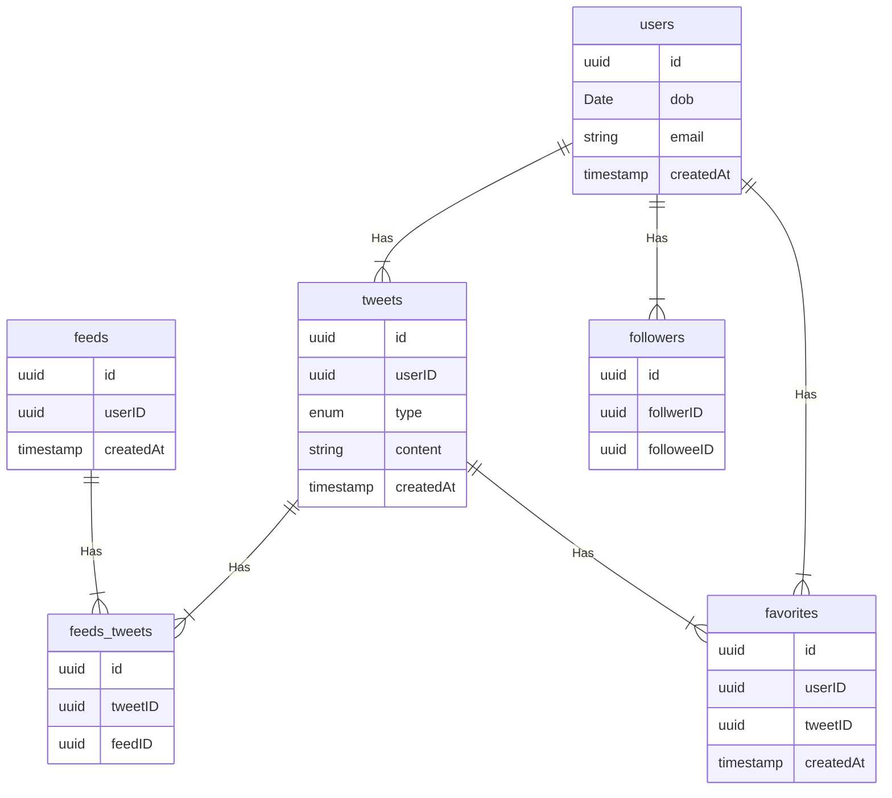

# Twitter
let us design a Twitter like social media service, similar to services like Facebook, Instagram, e.t.c.

## What is Twitter
Twitter is a social media service where users can read or post short messages (up to 280 characters) called tweets. it is available on the web and mobile platforms such as Android and iOS.

## Requirements
our system should meet the following requirements

### Functional Requirements
* should be able to post new tweets(can be text, image, video, e.t.c.)
* should be able to follow/unfollow other users
* should have a newsfeed feature consisting of tweets from the people the user is following
* should be able to search tweets
### Non-Functional Requirements
* High availability with minimal latency
* the system should be scalable and efficient

### Extended Requirements
* metrics and analytics
* retweet functionality
* favorite tweets

## Estimates and constraints
let us start with the estimations and constraints

PRO-TIP: ```make sure to check any scale or traffic-related assumptions with your interviewer```
### Traffic
This will be a read heavy system, let us assume we have 1 billion total users with 200 million daily active users(DAU) and on average each user tweets 5 times a day. this gives us 1 billion tweets per day

            200 million * 5 messages = 1 billion / day

Tweets can contain media such as images, or videos. we can assume that 10 percent of tweets are media files shared by the users, which give us additional 100 million files we would need to store

            10 percent * 1 billion = 100 million / day
### What would be Requests per second(RPS) for our system.
1 billion requests per day translates into 12K requests per second

            1 billion / (24 hrs * 3600 seconds) =~ 12K requests / second

## Storage
if we assume each message on average is 100 bytes, we will require about 100 GB of database storage every day. 
    
            1 billion * 100 bytes = 100 GB / day
we also know that around 10 percent of our daily messages(100 million) are media files per our requirements. if we assume each file is 50 KB on average we will require 5 TB of storage every day.

            100 million * 100 KB = 5 TB / day

and for 10 years, we will require about 19 PB of storage

## Bandwidth
as our system is handling 5.1TB of ingress every day, we will require a minimum bandwidth of around 60 MB per second

            5.1 TB / (24 Hrs * 3600 Seconds) =~ 60 MB / second
## High-Level estimate
here is a table representing our high level estimates

| Type                    | Estimate    |
|-------------------------|-------------|
| Daily Active Users(DAU) | 100 million |
| requests per second     | 12K/s       |
| storage(per day)        | ~5.1TB      |
| storage(10 years)       | ~19 PB      |
| Bandwidth               | ~60 MB/s    |   

## Data Model Design


let's go through the tables

    
### users
This table will contain a user's information such as ```name```, ```email```, ```dob```, and other details

### tweets
As the name suggests, this table will store tweets and their properties such as ```type```(text, image, video, e.t.c), ```content```, e.t.c. we will also store the corresponding ```userID```
### favorites
this table maps tweets with users for the favorite tweets functionality in our application
### followers
this table maps the followers and followees as users can follow each other(N:M relationship)
### feeds
this table stores feed properties with the corresponding ```userID```,
### feeds_tweets
this table maps tweets and feed(N:M relationship)

## what kind of database should we use
while our data model seems quite relational, we dont necessarily need to store everything in a single database, as this can limit our scalability and quickly become a bottleneck
we will split the data between different services each having ownership over a particular table. these we can use a relational database such as PostgreSQL or a distributed NoSQL database such as Apache Cassandra for our use case.

## API Design
let us do a basic api Design for our service
### Post a tweet
This API will allow the user to post a tweet on the platform
```java
postTweet(userID: UUID, content: string, mediaURL?: string): boolean
```
### parameters
User Id(```UUID```): ID of the user
Content(```string```): Contents of the tweet
Media URL(```string```): URL of the attached media(optional)

### Returns
Result(```boolean```): Represents whether the operation was successful or not

### Follow or Unfollow a User
This API allows the User to follow or unfollow another user
```java
follow(follwerID: UUID, foloweeID: UUID): boolean
unFollow(follwerID: UUID, foloweeID: UUID): boolean
```
### parameters
followerID Id(```UUID```): ID of the current user
followeeID Id(```UUID```): ID of the user to be followed or unfollowed
### Returns
Result(```boolean```): Represents whether the operation was successful or not

### Get newsFeed
This API will return all the tweets to be shown within a given newsfeed
```java
getNewsFeed(Userid: UUID ): Tweet[]
```
### parameters
User Id(```UUID```): ID of the user

### Returns
Tweets(```Tweet[]```): All the tweets to be shown within a given newsfeed.

## High-Level Design
Now let us do a high level design of our system

## Architecture
we will be using microservices architecture since it will make it easier to horizontally scale and decouple our services. each service will have ownership of its own data model. Let us try to divide our system into some core services.

### User Service
this service handles user-related concerns such as authentication and user information
### newsFeed Service
this service will handle the generation and publishing of user newsfeeds. it will be discussed in detail separately
### Tweet Service
the tweet service will handle tweet-related use cases such as posting a tweet, favorites, e.t.c.
### Search Service
The service is responsible for handling search-related functionality. it will be discussed in detail separately. 
### Media Service
This service will handle the media(images, videos, files, etc.) uploads. it will be discussed in detail separately.
### Notification Service
this service will simply send push notifications to the users
### Analytics Service
this service will be used for metrics and analytics use cases.

## What about inter-service communication and service discovery
since our architecture is micro-services based, services will be communicating with each other as well. generally REST, or HTTP performs well but we can further improve the performance using gRPC which is more lightweight and effiicient
service discovery is another thing we will have to take into account. we can also use a service mesh tat enables managed, observable, and secure communications between individual services. 

## News Feed
when it comes to the news feed, it seems easy enough to implement, but there are a lot of things that can make or break this feature. So let us divide our problem into two parts
### News Feed Generation
let us assume we want to generate the feed for user A, we will perform the following steps
1. Retrieve the IDs of all the users and entities(hashtags, topics, etc) user A follows
2. fetch the relevant tweets for each of the retrieved IDs
3. use a ranking algorithm to rank the tweets based on parameters such as relevance, time, engagement, etc.
4. return the ranked tweets data to the client in a paginated manner

Feed generation is an intensive process and can take quite a lot of time, especially for users following a lot of people. to improve the performance the feed can be pre-generated and stored in the cache, then we can have a mechanism to periodically update the feed and apply our ranking algorithm to the new tweets.

### News Feed Publishing
publishing is the step where the feed data is pushed according to each specific user. This can be a quite heavy operation, as a user may have millions of friends or followers. to deal with this, we have three different approaches

#### Pull Model(or Fan-out on load)

When a user creates a tweet, and a follower reloads their newsfeed, the feed is created and stored in memory. The most recent feed is only loaded when the user requests it. this approach reduces the number of write operations on our database.
the downside of this approach is that the users will not be able to view recent feeds unless they "pull" the data from the server, which will increase the number of read operations on the server.

#### push Model(or Fan-out on write)

in this model, once a user creates a tweet , it is "pushed" to all the followers feeds immediately. this prevents the system from having to go through a user's entire followers list to check for updates.
However, the downside of this approach is that it would increase the number of write operations on the database

#### Hybrid Model
a third approach between the pull and push model. it combines the beneficial features of the above two models and tries to provide a balanced approach between the two.
the hybrid model allows only users with lesser number of followers to use the push model and for users with a higher number of followers(celebrities), the pull model will be used.

### Ranking Algorithm
as we discussed we will need a ranking algorithm to rank each tweet according to its relevance to each specific user.
for example, Facebook used to utilize an EdgeRank algorithm, here, the rank of each feed item is described by.

            Rank = Affinity * Weight * Decay
whereby;
```Affinity```: is the "closeness"nof the user to the creator of the edge. if a user frequently likes, comments, or messages the edge creator, then the value of affinity will be higher, resulting in a higher rank for the post.
```weight```: is the value assigned according to each edge. A comment can have a higher weightage than likes, and thus a post with more comments is more likely to get a higher rank.
```Decay```: is the measure of the creation of the edge. the older the edge, the lesser will be the value of decay and eventually the rank. 
Nowadays, algorithms are much more complex and ranking is done using machine learning models which can take thousands of factors into consideration.

## Retweets
Retweets  are one of our extended requirements. to implement this feature we can simply create a new tweet with the user id of the user retweeting the original tweet and then modify the ```type``` enum and ```content``` property of the new tweet to link it with the original tweet
for example, the ```type``` enum property can be of type tweet, similar to text, video, etc and ```content``` can be the id of the original tweet. Here the first row indicates the original tweet while the second row is how we can represnt a retweet

| id |                       userid  |       type | content          |                 createdAt |
ad34-291a-45f6-b36c |	7a2c-62c4-4dc8-b1bb	| text | Hey, this is my first tweet… | 1658905644054
f064-49ad-9aa2-84a6 |	6aa2-2bc9-4331-879f | tweet| ad34-291a-45f6-b36c | 1658906165427

this is a very basic implementation, to improve this we can create a separate table itself to store retweets.

## Search
sometimes traditional DBMS are not performant enough, we need something which allows us to store, search, and analyze huge volumes of data quickly and in near real-time and give results within milliseconds. ElasticSearch can help us with this use case
ElasticSearch is a distributed, free and open search and analytics engine for all types of data, including textual, numerical, geospatial, structured and unstructured. it is built on top of Apache Lucene.

## How to identify trending topics
trending functionality will be based on top of the search functionality. we can cache the most frequently searched queries, hashtags, and topics in the last ```N``` seconds and update them every ```M``` seconds using some sort of batch job mechanism. our ranking algorithm can also be applied to the trending topics to give them more weight and personalize them for the user. 

## Notifications
push notifications are an integral part of any social media platform. we can use a message queue or a message broker such as Apache Kafka with the notification service to dispatch requests to FireBase cloud Messaging or Apple push notification service. which will handle the delivery of the push notifications to user devices

## Detailed Design
it is time to discuss our design decisions in detail
### Data Partitioning
to scale our database we will need to partition our data. Horizontal partitioning aka sharding can be a good first step. we can use partitions scheme such as 
* Hash-Based partitioning
* List-Based partitioning
* Range Based partitioning
* Composite partitioning

the above approaches can still cause uneven data and load distribution, we can solve this using Consistent Hashing

### Mutual friends
for mutual friends, we can build a social graph for every user. each node in the graph will represent a user and a directional edge will represent followers and followees. after that, we can traverse the followers of a user to find and suggest a mutual friend. this would require a graph database such as as Neo4j and ArangoDB
this is a pretty simple algortihm, to improve our suggestion accuracy, we will need to incorporate a recommendation model which uses machine learning as part of our algorithm.


## Metrics and Analytics
recording analytics is one of our extended requirements. as we will be using Apache Kafka to publish all sorts of events, we can process these events and run analytics on the data using Apache Spark which is an open-source unified analytics engine for large scale data processing.

## caching
in a social media application, we have to be careful about using cache as our users expect the latest data. So, to prevent usage spikes from our resources we can cache the top 20% of the tweets.
to further improve efficiency we can add pagination to our system APIs. This decision will be helpful for users with limited network bandwidth as they wont have to retrieve old messages unless requested.

#### which cache eviction policy to use?
we can use solutions like Redis or Memcached and cache 20% of the daily traffic but what kind of cache eviction policy would best fit our needs?
Least Recently Used can be a good policy for our system. in this policy we discard the least recently used key first.

#### how to handle cache miss
whenever there is a cache miss, our servers can hit the database directly and update the cache with the new entries

## Media Access and storage
as we are aware, most of our storage space will be used for storing media files such as images, videos, or other files. our media service will be handling both access and storage of the user media files.
but where can we store files at scale? well, object storage is what we are looking for. object storage breaks data files up into pieces called objects. it then stores those objects in a single repository, which can be spread out across multiple networked systems. we can also use distributed file storage such as HDFS or GlusterFS

## CDN
this increases content availability and redundancy while reducing bandwidth costs. generally, static files such as images and videos are served from cdn. we can use services like Amazon CloudFront or Cloudflare CDN for ths use case.

## Identify and resolve bottlenecks

let us identify and resolve bottlenecks such as single points of failure in our design

* What if on of our services crashes
* how will we distribute our traffic between our components
* how can we reduce the load on our database
* how to improve the availability of our cache
* how can we make our notification system more robust
* how can we reduce media storage costs

to make our system more resilient we can do the following
* running multiple instances of each of our services
* introducing load balancers between clients, servers, databases and cache servers
* using multiple read replicas for our databases
* multiple instances and replicas for our distributed cache
* exactly one delivery and message ordering is challenging in a distributes system, we can use a dedicated message broker such as apache kafka or NATS to make our notification system more robust
* we can add media processing and compression capabilities to the media service to compress large files which will save a lot of storage space and reduce cost


