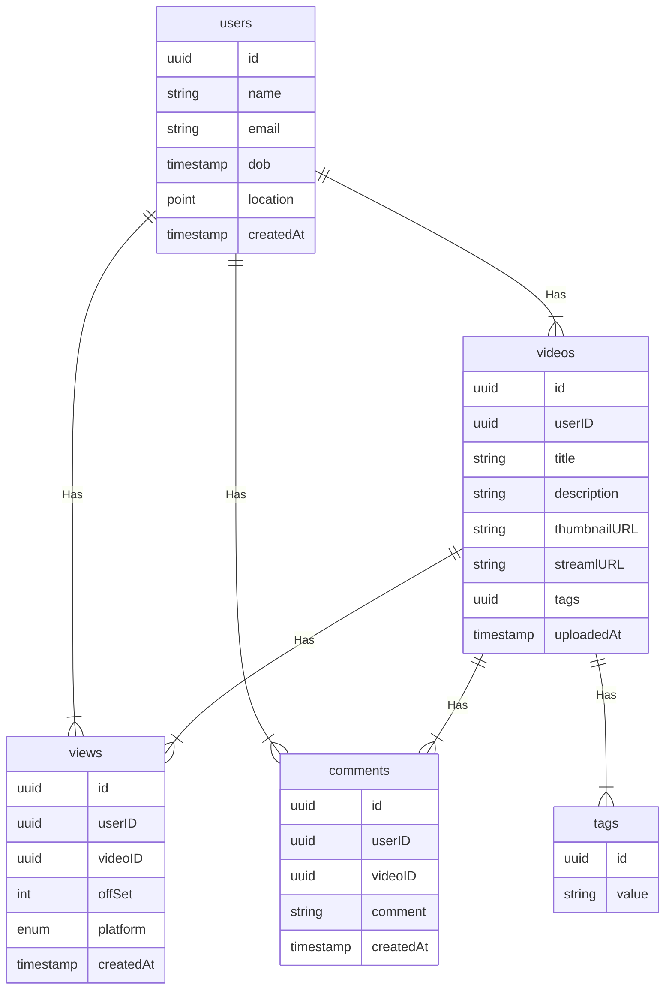

# Netflix
Let's design a netflix like video streaming service, similar to services like Amazon Prime, Disney plus, Hulu, Youtube, Vimeo, e.t.c

## What is Netflix
Netflix is a subscription based streaming service that allows its members to watch Tv shows and movies on an internet-connected device. it is available on platforms such as web, iOS, Android, TV E.T.C

## Requirements
our system should meet the following requirements

###  Functional Requirements
* users should be able to stream and share videos
* the content team (or users in Youtube's case) should be able to upload new videos(movies, tv shows, and other content)
* users should be able to search for videos using titles or tags
* users should be able to comment on a video similar to Youtube

### Non-Functional Requirements
* High availability with minimal latency
* high reliability, no uploads should be lost
* the system should be scalable and efficient
### Extended Requirements
* certain content should be geo-locked
* resume video playback from the point the user left off.
* record metrics and analytics of videos

### Estimation and Constraints
let us start with estimation and constraint
Pro-Tip -> Make sure to check any scale or traffic related assumptions with your interviewer

## Traffic
this will be a read-heavy system, let us assume we have 1 billion total users with 200 million daily active users, and on average each user watches 5 videos a day. This gives us 1 billion videos watched per day

        200 million * 5 videos = 1 billion / day
assuming, a ```200:1``` read/write ratio, about 50 million videos will be uploaded every day.

        1 / 200 * 1 billion = 50 million / day

### What would be requests oer second for our system
1 billion requests per day translates into 12K requests per second.

            1 billion / (24 hrs * 3600 seconds) =~ 12K / second
## Storage
if we assume each video is 100MB on average, we will require about 5 PB of storage every day.

            50 million * 100 MB = 5 PB / day
and for 10 years, we will require an astounding 18, 250 PB of storage
        
        5 PB * 365 days * 10 years = 18,250 PB
## Bandwidth
as our system is handling 5 PB of ingress every day, we will require minimum bandwidth of around 58 GB per second
        
            5 PB / (24 hrs * 3600 seconds) =~ 58 GB / second

### High-Level Estimates
here is our high level estimates table

| Type                | Estimate    |
|---------------------|-------------|
| daily active users  | 200 million |
| Requests per second | 12K/s       |
| storage(per day)    | ~5 PB       |
| storage(10 years)   | ~18, 250 PB |
| Bandwidth           | ~58 GB/s    |

## Data-Model Design


Let's go through the tables

### users
This table will contain a user's information such as ```name```, ```email```, ```dob```, and other details
### videos
as the name suggests, this table will store videos and their properties such as ```title```, ```streamURL```, ```tags```. e.t.c
### tags
this table will simply store tags associated with a table
### views
this table helps us store all the views associated with a video
### comments
this table stores all the comments received on a video(Like Youtube)

### What kind of database should we use
while our data model seems quite relational, we dont necessarily need to store everything in a single database. this can limit our scalability and quickly become a bottleneck

we will split the data between different services each having ownership over a particular table. then we can use a relational database such as postgresql, or a distributed NonSQL database such as apache cassandra for our use case

## API Design
let us do a basic API design for our system

### Upload a video
Given a byte stream, this API enables video to be uploaded to our service.

```java
uploadVideo(title: string, description: string, data: Stram<byte>, tags?:string[]): boolean
```
### Parameters
Title(```string```): Title for the new video
Description(```string```): Description of the new video
Data(```Byte[```): Byte stream of the video data
Tags(```string```): Tags for the video(optional)

#### Returns
Result(```boolean```): Represents whether the operation was successful or not

### Streaming a video
This API allows our users to stream a video with the preferred codec and resolution.
```java
streamVideo(videoID: UUID, codec: Enum<string>, resolution: Tuple<int>, offset?: int): VideoStream
```
### Parameters
Video Id(```uuid```): ID of the video that needs to be streamed
Codec(```Enamu<string>```): required codec of the requested video, such as ```h.265```, ```h.264```, ```VP9```, etc
Resolution(```Tuple<int>```): Resolution of the requested video
Offset(```int```): offset of the video stream in seconds to stream data from any point in the video(optional)
#### Returns
Stream(```VideoStream```): Data stream of the requested video.

### Search for a video
this API will enable users to search for a video based on its titles or tags

```java
searchVideo(query: string, nextPage?: string): Video[]
```
#### Parameters
Query(```string```) : search query from the user
Next Page(```string```): Token for the next page , this can be used for pagination(optional)

#### Returns
Videos(```video[]```): all the videos available for a particular search query

### Add a comment
This API will allow our users to post a comment on a video(like Youtube)
```java
comment(videoID: UUID, comment: string): boolean
```
#### Parameters

VideoID(```UUID```): Id of the video a user want to comment on
Comment(```string```): the text content of the comment

#### Returns
Result(```boolean````): Represents whether the operation was successful or not

## High Level Design
now let us do a high level design for our system.

### Architecture
we will be using microservices architecture since it will make it easier to horizontally scale and decouple our services. each service will have ownership of ots own data model. let us try to divide our system into some core services

### User service
this service handles user-related concerns such as authentication and user information
### Stream service
the stream service will handle video streaming-related functionality
### search service
the service is responsible for handling search related functionality. it will be discussed in detail separately.
### Media service
this service will handle the video uploads and processing. it will be discussed in detail separately
### Analytics service
this service will be used for analytics and metrics use cases

## What about inter-service communication and service discovery
since our architecture is micro-services based, services will be communicating with each other as well. Generally REST. or HTTP performs well but we can further improve the performance using gRPC which is more lightweight and efficient.

service discovery is another thing we will have to put into account. we can also use a service mesh that enables managed , observable, and secure communication between individual services.

### Video Processing
there are so many variables at play when it comes to video processing for example, an average data size of two-hour raw 8K footage from a high-end camera can easily be up to 4 TB, thus we need to have some kind of processing to reduce both storage and delivery costs.
here is how we can process videos once they are uploaded by the content team or users in the case of youtube and are queued for processing in our message queue.


let us discuss how this works

### File Chunker
this is the first step of our processing pipeline. file chunking is the process of splitting a file into smaller pieces called chunks. it can help us eliminate duplicate copies of repeating data on storage, and reduces the amount of data sent over the network by only selecting changed chunks.
usually, a video file can be split into equl size chunks based on time stamps but Netflix instead splits chunks based on scenes, this slight variation become a huge factor for a better user experience as whenever the client requests a chunk from the server, there is a lower chance of interruption as a complete scene will be retrieved.


### Content Filter
this step checks if the video adheres to the content policy of the platform, this can be pre-approved in the case of netflix as per the content rating of the media or can be strictly enforced like YouTube

this entire step is done by a machine learning model which performs copyright, piracy, and NSFW checks. if issues are found, we can push the task to a dead-letter queue and someone from the moderation team can do further inspection.

### Transcoder
Transcoding is a process in which the original data is decoded to an intermediate uncompressed format, which is then encoded into the target format. This process uses different codec to perform bitrate adjustment, image down sampling, or en-coding the media
this results in a smaller size file and a much more optimized format for the target devices. standalone solutions such as FFmpeg or cloud-based solutions like AWS elemental mediaconvert can be  used to implement this step of the pipeline. 

### Quality Conversion
this is the last step of the processing pipeline and as the name suggests, this step handles the conversion of the transcoded media from the previous step into different resolutions such as 4K, 1440P, 1080P, 720P, etc
this allows us to fetch the desired quality of the video as per the user's request, and once the media file finishes processing , it will be uploaded distributed file storage such as HDFS, GlusterFC, or an object storage such as Amazon S3 for later retrieval during streaming
NOTE -> we can add additional steps such as subtitles and thumbnails generation as part of our pipeline
### Why are we using a message queue
processing video as a long-running task makes much more sense, and a message queue also decouples our video processing pipeline from the uploads functionality we can use something like Amazon SQS or RabbitMQ to support this.

## Video Streaming
video streaming is a challengin task from the client and server side perspectives. morever, internet connection speeds cary quite a lot between different users. to make sure users don't re-fetch the same content, we can use a CDN
Netflix takes this a step further with its open Connect program. in this approach, they partner with thousands of Internet Service Providers to localize their traffic and deliver their content more efficiently.

### What is the difference between Netflix's open connect and a traditional CDN
Netflix open connect is our purpose-built CDN responsible for serving Netflix's video traffic. around 95% of the traffic globally is delivered via direct connections between open connect and the ISPs their customers use to access the internet. 

Currently, they have Open connect Appliances, in over 1000 separate locations around the world. in case of issues, open connect applicances can failover, and the traffic can be re-routed to Netflix servers.
additionally, we can use adaptive bitrate streaming protocols such as HTTP Live Streaming which is designed for reliability and it dynamically adapts to network conditions by optimizing playback for the available speed of the connections

las
## Searching
sometimes, traditional DBMS are not performant enough, we need something which allows us to store, search and analyze huge volumes of data quickly and in near real-time and give results within miliseconds. elasticsearch can help us with this use case. Elasticsearch is a distributed free and open search and analytics engine for all types of data, including textual, numerical, geospatial, structured and unstructured. it is built on top of Apache Lucene

### How do we identify trending content?
Trending functionality will be based on top of the search functionality. we can cache the most frequently searched queries in the last ```N``` seconds and update them every ```M``` seconds using some sort of batch job mechanism.

### Sharing
sharing content is an important part of any plattform, for this, we can have some sort of URL shortener service in place that can generate short URLs for the user to share. 

## Detailed Design
it is time to discuss our design decisions in detail

### Data Partitioning
to scale our database we will need to partition our data. Horizontal partitioning aka sharding can be a good first step. we can use partition scehmes such as 
* Hash-Based partitioning
* List-Based partitioning
* Range-Based partitioning
* Composite partitioning
the above approaches can still cause uneven data and load distribution, we can solve this using Consistent Hashing.

## Geo-Blocking
platforms like Netflix and youtube use geo-blocking to restrict content in certain geographical areas or countries. this is primarily done due to legal distribution laws that Netflix has to adhere to when they make a deal with the production and distribution industries. in the case of Youtube, this will be controlled by the user during the publishing of the content.

we can determine the user's location either by using their IP or region settings in their profile then use services like amazon cloudfront which supports a geographic restrictions feature or a geogrpahic routing policy. with Amazon route53 to restrict the content and reroute the user to an error page if the content is not available in that particular region or county.


## Recommendations
Netflix uses a machine learning model which uses the user's viewing history to predict what the user might like to watch next, an algorithm like Collaborative filtering can be used.

however Netflix(like youtube) uses its own algorithm called Netflix recommendation engine which can track several data points such as.
* user profile information like age, gender, and location
* browsing and scrolling behaviour of the user
* time and date a user watched a title
* the device which was used to stream the content
* the number of searches and what terms were searched
## Metrics and Analytics
recording analytics and metrics is one of our stretch requirements. we can capture the data from different services and run analytics of the data using apache spark whic is an open source unified analytics engine for large-scale data processing. additionallly, we can store critical metadata in the views table to increase data points within oour data.

## Caching
ina streaming platform, caching is important. we have to be able to cache as much static media content as possible to improve user experience. we can use solutions like Redis or memcached but what kind of cache evition policy would best fit our needs?

### which cache eviction policy to use?
Least recently used can be a good policy for our system . in this policy, we discard the least recently used key first.

### how to handle cache miss
whenever there is a cache miss, our servers can hit the database directly and update the cache with the new entries.

## Media streaming and storage
as most of our storage space will be used for storing media files such as thumbnails and videos. per our discussion earlier, the media service will be handling bth the upload and processing of media files.

we will use distributed file storage such as HDFS , GlusterFS or an object storage such as amazon s3 for storage and streaming of the content.

### CDN
CDN increases content availability and redundancy while reducing bandwidth costs. we can use services like Amazon cloudfront and cloudflare cdn for this use case.

## Identify and resolve bottlenecks


let us identify and resolve bottlenecks such as single points of failure in our design
* what if one of our services crashes
* how will we distribute our traffic among our components
* how can we reduce the load on our database
* how to improve the availability of our cache
to make our system more resilient we can do the following
* running multiple instances of each of our services
* introducing load balancers between clients, services, databases and cache servers
* using multiple read replicas for our databases
* multiple instances and replicas for our distributed cache

