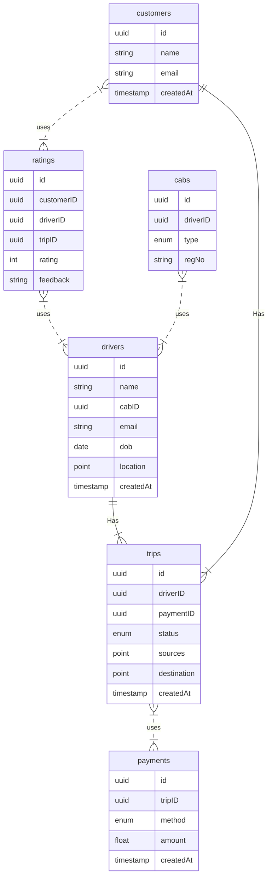

# Uber
Let us design Uber like ride-hailing service, similar to services like Lyft, Ola, Cabs, etc.

## What is Uber
uber is a mobility service provider, allowing users to book rides and a driver to transport them in a way similar to a taxi. it is available on the web and mobile plaforms such as Android and iOS
## Requirements
our system should meet the following requirements
### Functional Requirements
we will design our system for two types of users. Customers and Drivers
#### Customers 
* Customers should be able to see all the cabs in the vicinity with an ETA and pricing Format
* customers should be able to book a cab to a destination
* customers should be able to see the location of the driver
#### Drivers
* drivers should be able to accept or deny the customer requested ride
* once a driver accepts the ride, they should see the pickup location of the customer
* drivers should be able to mark the trip as completed on reaching the destination
### Functional Requirements
* High reliability
* high availability with minimal latency
* the system should be scalable and efficient
### Non-Functional Requirements
* customers can rate the trip after it is completed
* payment processing
* metrics and analytics
### Estimation and constraints
let us start with the estimations and constraints
### Traffic
let us assume we have 100 million active daily users with 1 million drivers and on average our platform enables 10 million rides daily. 
if on average each user performs 10 actions such as request a ride, check available rides, fares, book rides etc. we will have to handle 1 billion requests daily.

            100 million * 10 actions = 1 billion / day

#### What would be the requests per second
1 billion requests per day translates into 12K requests per second

            1 billion / (24 hrs * 3600 seconds) =~ 12K requests / second
### Storage
if we assume every requests on average is 400 bytes, we will require about 400 GB of database storage every day

            1 billion * 400 bytes =~ 400 GB / day
and for ten years we will require up to 1.4PB of storage

            400 GB * 365 days * 10 years =~1.4 PB

### Bandwidth
as our system is handling 400 GB of ingress every day, we will require a minimum bandwidth of around 4 MB per second

            400 GB / (24 hrs * 3600 seconds) =~ 5 MB / second
### High level estimates
here is our high level estimate

| Type                | Estimate    |
|---------------------|-------------|
| daily active users  | 100 million |
| Requests per second | 12 K/s      |
| storage per day     | ~400 gb     |
| storage(10 years)   | 1.4 PB      |
| Bandwidth           | ~5MB/s      |

### Data Model Design
this is the general data model which reflects our requirements


let us go through the tables

#### customers
this table will contain a customer's information such as ```name```, ```email```, and other details

#### drivers
this table will contain a driver's information such as ```name```, ```email```, ```dob```, and other details

#### trips
this table represents the tripp taken by the customer and stores data such as ```source```, ```destination```, and ```status```, of the trip

#### cabs
this table stores data such as the registration number, and type(like Ube Go, Uber XL, etc.) of the cab that the driver will be driving

#### ratings
as the name suggests, this table stores the ```rating``` and feedback for the trip

#### payments
the payments table contains the payment-related data with the corresponding ```tripID```

### What kind of database should we use
while our data model seems quite relational, we don't necessarily need to store everything in a single database, as this can limit our scalability and quickly become a bottleneck

we will split the data between different services each having ownership over a particular table. then we can use a relational database such as PostgresQL or a distributed noSQL database such as Apache Cassandra


### API Design
let us do a basic API design for our system

#### Request a Ride

through this API, customers will be able to request a ride

```java
requestRide(customerID: UUID, source: Tuple<float>, destination: Tuple<float>, cabType: Enum<string>, paymentMethod: Enum<string>): Ride
```
#### Parameters
Customer ID(```UUID```): Id of the customer
Source(```Tuple<float>```): Tuple containing the latitude and longitude of the trip's starting location
Destination(```Tuple<float>```): Tuple containing the latitude and longitude of the trip's destination

#### Returns
Result(```Ride```): matched with the driver


#### Cancel the Ride

through this API, customers will be able to cancel a ride

```java
cancelRide(customerID: UUID, reason?: string): boolean
```
#### Parameters
Customer ID(```UUID```): ID of the customer
Reason(```string```): Reason for cancelling the ride(optional)

#### Returns
Result(```boolean```): Represents whether the operation was successful or not.

#### Accept or deny the Ride

through this API, drivers will be able to accept or deny a ride

```java
acceptRIDE(driverID: UUID, rideID: UUID ): boolean
```
#### Parameters
driver ID(```UUID```): Id of the driver
ride  ID(```UUID```): Id of the customer requested ride

#### Returns
Result(```boolean```): Represents whether the operation was successful or not.


#### Start or End the Trip

through this API, drivers will be able to start and end a ride

```java
startTrip(driverID: UUID, tripID: UUID ): boolean
endTrip(driverID: UUID, tripID: UUID ): boolean
```
#### Parameters
driver ID(```UUID```): ID of the driver
ride  ID(```UUID```): ID of the requested ride

#### Returns
Result(```boolean```): Represents whether the operation was successful or not.


#### Rate the Trip

through this API, customers will be able to rate the trip

```java
rateTrip(customerID: UUID, tripID: UUID, rating : int, feedback? : string ): boolean
```
#### Parameters
customer ID(```UUID```): ID of the customer giving feedback
ride  ID(```UUID```): ID of the completed trip
Feedback(```string```): feedback about the trip by the customer(optional)

#### Returns
Result(```boolean```): Represents whether the operation was successful or not.

## High Level Design
now let us do a high level design for our system

### Architecture
we will be using microservices architecture since it will make it easier to horizontally scale and decouple our services. each service will have ownership of its data model. let us try to split our system into core services

### customer service
this service handles customer-related concerns such as authentication and customer information

### Driver service
this service offers driver-related concerns such as authentication and driver information

### Ride service
This service will be responsible for ride matching and quadtree aggregation, it will be discussed in detail separately.

### Trip service
the service handles trip-related functionality in our system

### payment service
this service will be responsible for handling payments in our system

### Notification service
this service will simply send push notifications to the users. it will be discussed in detail separately

### Analytics service
this service will be used for metrics and analysis use cases.

## What about inter-service communication and service discovery?
since our architecture is microservices-based, services will be communicating with each other as well. generally REST or HTTP performs well but we can further improve the performance using gRPC which is more lightweight and efficient

service discovery is another thing we will have to take into account. we can also use a service mesh that enables managed, observable, and secure communication between individual services.

### How is the service expected to work

here is how the service is expected to work


1. customer requests a ride specifying the source, destination, cab type, payment method, etc.
2. Ride service registers this request, finds nearby drivers, and calculates the estimated time of arrival.
3. the request is the broadcasted to the nearby drivers for them to accept or deny
4. if the driver accepts, the customer is notified about the live location of the driver with the estimated time of arrival while they wait for pickup
5. the customer is picked up and the driver can start the trip
6. once the destination is reached, the driver will mark the ride as complete and collect payment
7. after the payment is complete, the customer can leave a rating and feedback for the trip if they like
### Location Tracking
how do we efficiently send and receive live location data from the client (customers and drivers) to our backend? we have two different options

#### pull model
the client can periodically send an HTTP request to servers to report its current location and receive ETA and pricing information. this can be achieved by something like long polling
#### push model
the client opens a long-lived connection with the server and once new data is available it will be pushed to the client. we can use websockets or server sent events for this

the pull model approach is not scalable as it will create unnecessary request overhead on our servers and most of the time the response will be empty, thus wasting our resources. to minimize latency, using the push model with web sockets is a better choice because then we can push data to the client once it is available without any delay given the connection is open with the client. Also, websockets provide full-duplex communication, unlike server sent events which are unidirectional
Additionally, the client application should have some sort of background job mechanism to ping GPS location while the application is in the background

### Ride Matching
we need a way to efficiently store and query nearby drivers. let us explore different soltions we can incorporate to our design

#### SQL
we already have access to the latitude and longitude of ur customers, and with databases like PostgreSQL and mySQL we can perform a query to find nearby driver locations given a latitude and longitude(X, Y) within a radius (R).

```sql
SELECT * FROM LOCATIONS WHERE lat BETWEEN X-R AND X+R AND long BETWEEN Y-R AND Y+R
```
however this is not scalable and performing this query on large data sets will be quite slow.

### Geo Hashing
Geohashing and geocoding method used to encode geographic coordinates such as latitude and longitude into short alphanumeric strings.

Geohashing is a hierarchical spatial index that uses Base-32 alphabet encoding, the first character in a geohash identifies the initial location as one of the 32 cells. this will also contain 32 cells. this means that to represent a point , the worl id recursively divided into smaller and smaller cells with each additional bit until the desired precision is attained. the precision factor also determines the size of the cell.


for example, San Francisco with coordinates ```37.7564, -122.4016``` can be represented in geohash as ```9q8yy9mf```
Now using the customers geohash we can determine the newarest available driver by simply comparing it with the driver's geohash. for better performance, we will index and store the geohash of the driver in memory for faster retrieval

### Quadtrees
A quadtree is a tree data structure in which each internal node has exactly four children. they are often used to partition a two-dimensional space by recursively subdividing it into four quadrants or regions. each child or leaf node stores spatial information . quadtrees are the two-dimensional analog of octrees which are used to partition three-dimension space. 

quadtrees enable us to search points within a two-dimensional range efficiently, where those points are defined as latitude/longitude coordinates or as cartesian(X, Y) coordinates.

we can save further computation by only subdividing a node after a certain threshold.


Quadtree seems perfect for our use case, we can update the Quadtree every time we recieve new location update from the driver. to reduce the load on the quadtree servers we can use and in-memory data store such as Redis to cache the latest updates. and with the application of mapping algorithms such as Hilbert curve, we can perform efficient range queries to find nearby drivers for the customer

#### What about race conditions
Race conditions can occur when a large number of customers will be requesting rides simultaneously. to avoid this, we can wrap our ride matching logic in a Mutex to avoid any race conditions. furthermore, every action should be transactional in nature. 

#### How to find the best drivers nearby?
once we have a list of nearby drivers from the quadtree servers, we can perform some sort of ranking based on parameters like average ratings, relevance, past customer feedback, etc. This will allow us to broadcast notifications to the best available drivers first


#### Dealing with high demand
in case of high demand, we can use the concept of Surge Pricing. surge pricing is a dynamic pricing method where prices are temporarily increased as a reaction to increased demand and mostly limited supply. this surge price can be added to the base price of the trip. 
#### payments
Handling payments at scale is challenging, to simplify our system we can use a third-party payment processor like Stripe or Paypal. once the payment is complete, the payment processor will redirect the user back to our application and we can set up a webhook to capture all the payment-related data
#### Notifications
Push notifications will be an integral part of our platform. we can use a message queue or a message broker such as Apache Kafka with the notification service to dispatch requests to FCM or APNS. which will handle the delivery of the push notifications to user devices.

## Detailed Design
it is time to discuss our design decisions in detail
### Data Partitioning

to scale our databases, we will need to partition our data. Horizontal partitioning aka sharding can be a good first step. we can shard our database either based on existing partition schemes or regions. if we divide the locations using let's say zip codes, we can effectively store all the data in a given region on a fixed node. but this can still cause uneven data and load distribution, we can solve this using consistent hashing

### Metrics and Analytics
recording analytics and metrics is one of our extended requirements. we can capture the data from different services and run analytics on the data using Apache Spark which is an open-source unified analytics engine for larg-scale data processing. additionally, we can store critical metadata in the views table to increase data points within our data. 
### Caching
in a location-based services platform, caching is important. we have to be able to cache the recent locations of the customers and drivers for fast retrieval. we can use solutions like Redis or Memcached but what kind of cache eviction policy would best fit our needs. 
#### which cache eviction policy to use?
Least recently used can be a good policy for our system. in this policy, we discard the least recently used key first. 
#### How to handle cache miss?
whenever there is a cache miss, our servers can hit the database directly and update the cache with the new entries

## Identify adn resolve bottlenecks


Let us identify and resolve bottlenecks such as single points of failure in our design.
* what if one of our services crash?
* how will we distribute our traffic between our components
* how can we reduce the load on our database
* how to improve the availability of our cache
* how can we make our notification system more robust
To make our system more resilient we can do the following
* running multiple instances for each of our services
* introducing load balancers between our clients, servers, databases and cache servers
* using multiple read replicas for our databases
* multiple instances and replicas for our distributed cache
* exactly once delivery and message ordering is challenging in a distributed system, we can use a dedicated message broker such as Apache Kafka or NATS to make our notification system more robust.
* 


