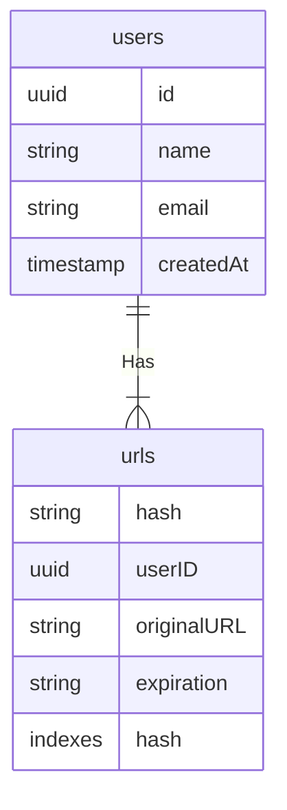
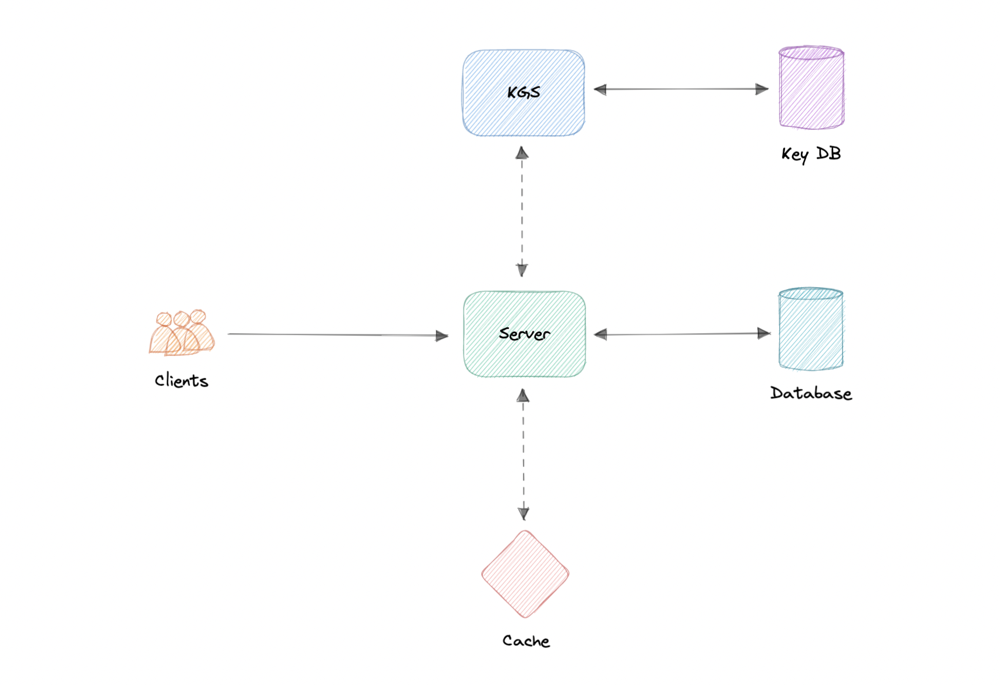

# URL Shortener
Let us design a URL, similar to services like [Bitly](https://bitly.com/), [TinyUrl](https://tinyurl.com/app)

## What is a URL Shortener
a URL shortener service creates an alias or a short URL for a long URL. Users are redirected to the original URL when they visit these short links

## Why do we need a URL Shortener
* saves space in genera when we are sharing a URL;
* Users are less likely to mistype a shorter URL
* we can optimize links across devices, allowing us to track individual links
## Requirements
A URL shortening service should meet the following requirements
### functional Requirements
- given a URL, our service should generate a shorter and unique alias for it
- users should be redirected to the original URL when they visit the short Link.
- links should expire after a default lifespan

### Non-functional Requirements   
- High availability with minimal latency
- The system should be scalable and efficient


### Extended Requirements   
- Prevent abuse of service
- Record analytics and metrics for redirections  
## Estimation and Constraints
let us start with the estimations and constraints
PRO TIP -> make sure to check any scale or traffic related assumptions with your interviewer

### Traffic
THis will be a read-heavy system, so let us assume a  100:1  read/write ratio with 100 million links generated per month

#### Reads/Writes per month

for reads per month

       100 * 100 million = 10 billion / month

for writes per month  

        1 * 100 million = 1000 million / month

#### What would be Requests per second for our system
100 million requests per month translates into 40 requests per second
        
         100 million / (30 days * 24 hrs * 3600 seconds) = ~ 40 urls / second
and with 100:1 read/write ratio, the number of redirections will be

        100 * 40 URLS/second = 4000 requests / second

#### Bandwidth
since we expect about 40 URLs every second, and if we assume each request is of size 500 bytes then the total incoming data for the write requests would be
        
        40 * 500 bytes = 20 KB / second
similarly, for the read requests, since we expect   about 4K redirections, the total outgoing data would be
        
        4000 URLS / second * 500 bytes = ~ 2 MB / second

#### Storage
 for storage, we will assume we store each link or record in our database for 10 years. Since we expect around 100 million new requests every month, the total number of records we will need to store would be 
        
        100 million * 10 years * 12 months = 12 billion  URLs

Like earlier, if we assume each stored record will be approximately 500 bytes. we will need around 6TB of storage
        
        12 billion *  500 bytes = 6 TB
#### Cache
for caching, we will follow the classic [pareto principle ](https://en.wikipedia.org/wiki/Pareto_principle) also known as the 80/20 rule. this means that 80% of the requests are for 20% of the data, so we can cache around 20% of our requests
since we get around 4K read or redirection requests each second.this translates into 350M requests per day.

        4000 URLs / second * 24 Hrs * 3600 seconds = ~350 millio r. 

this means we will need around 35 GB of memory per day
        
        20 percent * 350 Million * 500 bytes = 35 GB / per day

 #### High Level Estimates
| Type                | Estimate     |
|---------------------|--------------|
| Writes(new URLs)    | 40/s         | 
| Reads(Redirection)  | 4K/s         |
| Bandwidth(Incoming) | 20 Kb/s      |    
| Bandwidth(Outgoing) | 2 MB/s       |    
| Storage(10 Yrs)     | 6 TB         |    
| Memory(Caching)     | 350 GB / Day |    
 
## Data Model Design
next we will focus on the data model design. Here s our database schema


initially we can get started with just two tables.

#### users
Stores user's details sucha as ``` name, email, createdAt,``` etc

#### urls  
Contains the new short URL's properties such as ```expration, hash, originalURL, userId``` of the user who created the short URL. we can also use the hash column as an index to improve the query performance.

### What kind of database should we use
Since the data is not strongly relational, NoSQL databases such as ```Amazon DynamoDB, Apache Cassandra, MongoDB``` will be a better choice here, if we do decide to use an SQL database then we can use something like Azure SQL Database, or Amazon RDS

## API Design
let us do a basic API design for our services.

### create URL
This API should create a new short URL in our system given an original URL.

```java 
createURL(apiKey: String, originalURL: string, expiration?: Date) : String
```
#### Parameters
- API Key (```string ```): API Key provided by the user
- Original URL(```string ```): Original URL to be shortened
- Expiration(```Date ```): Expiration Date of the new URL(optional)

#### Returns
Short URL ( ```string ```) : New shortened URL
 
### Get URL  
this API should retrieve the original URL from a given short URL.
```jav
getURL(apiKey: String, shortURL: string) : String
```              
#### Parameters                                                        
 - API Key (```string ```): API Key provided by the user                
 - Short URL(```string ```): short url mapped to the original url

#### Returns                                       
Original URL ( ```string ```) : original url to be retrieved

### Delete URL     
this API should delete a given short URL from our system

 ```jav
 deleteURL(apiKey: String, shortURL: string) : boolean
 ```   
#### Parameters                                                   
 - API Key (```string ```): API Key provided by the user          
 - Short URL(```string ```): short url to be deleted 

#### Returns                                                  
result ( ```boolean ```) : Represents whether the operation was successful or not.
 
### Why do we need an API Key
As you must have noticed we are using an API key to prevent abuse of our services. using thei API key we can limit the users to a certain number of requests per second or minute. this is quite a standard practice for developer APIs and should cover our extended requirement.

## High Level Design
now let us do a high level design for our system
### URL Encoding
our system's primary goal is to shorten a given URL, let us look at different approaches

#### Base62 Approach
in this approach we can encode the URL using Base62 which consists of the capital letters A-Z, small case letters a-z, and numbers 0-9.
        
                Number of URLs = 62 ** N
```N```: Number of characters in the generated URL

So, if we want to generate a URL that is 7 characters long, we will generate ~3.6 Trillion different URLs.
        
                62 ** 5 =~ 916 million URLs
                62 ** 6 =~ 56.8 billion URLs
                62 ** 7 =~ 3.5 trillion URLs  

this is the simplest solution here, but it does not guarantee non-duplicate or collision-resistant keys.

#### Md5 Approach 
the Md5 message-digest algorithm is a widely used hash function producing a 128-bit hash value(or 32 hexadecimal digits). We can use thes 32 hexadecimal digits for generating 7 characters long URL.

                MD5(original_url) -> base62encode -> hash
however, this creates a new issue for us, which is duplication and collision. we can try to re-compute the hash untill we find a unique one but that will increase the overhead of our system. it is better to look for more scalable approaches

#### Counter Approach 
in this approach, we will start with a single server which will maintain the count of the keys generated. once our service receives a request, it can reach out to the counter which returns a unique number and increments the counter. when the next request comes the counter again returns the unique number and this goes on.
        
                Counter(0 - 3.5 trillion) -> base62encode -> hash

the problem with this approach is that it can quickly become a single point of failure. and if we run multiple instances of the counter we can have collision as it is essentially a distributed system.

to solve this issue we can use a distributed system manager such as Zookeeper which can provide distributed synchronization. zookeeper can maintain multiple ranges for our servers
        
                Range 1 : 1 -> 1 , 000, 000 Range 2 : 1 , 000, 001 - > 2 , 000, 000    Range 3 : 2 , 000, 001 - > 3 , 000, 000    ...
once a server reaches its maximum range, zookeeper will assign an unused counter range to the new server. this apporach can guarantee non-duplicate anc collision resistant URLs. also we can run multiple instances of zookeeper to remove the single point of failure
## Key Generation Service
as we discussed,  generating a unique key at scale without duplication and collisions can be a bit of a challenge. to solve this problem, we can create a standalone key generation service that generates a unique key aheaf of time and stores it in a separate database for later use. This approach can make things a bit simple for us. 

#### How to handle concurrent access
once the key is used, we can mark it in the database to make sure we don't reuse it, however, if there are multiple server instances reading data concurrently, two or more servers might try to use the same key.
the easiest way to solve this would be to store keys in two tables.   as soon as a key is used we move it to a separate table with appropriate locking in place.Also, to improve reads, we can keep some of the keys in memory.

#### KGS database estimations
as per our discussion, we can generate up to ~56.8 billion unique 6 character long keys which will result in us having to store 33 GB of keys

        6 characters * 56.8 billion =~ 390 GB
while 390 GB seems like a lot for this simple use case, it is important to remember this is for the entirety of our service lifetime and the size of the keys database would not increase like our main database. 

### Caching
Now let us talk about caching, as per our estimations, we will require around ~35GB of memory per day to cache 20% of the incoming requests to our services. for this use case we can use Redis or Memcached servers alongside  our API server

## Design
Now that we have identified some core components, let us do the first draft of our system design. 


 
#### Creating Anew URL
1. when  a user creates a new URL, Our API server requests a new unique key from the Key Generation Service.
2. Key Generation Service provides a unique key to the API server and marks the key as used
3. API server writes the new URL entry to the database and cache.
4. our service returns a http 201  (created) response to the user. 

#### Accessing a  URL 
1. when a user navigates to a certain short URL, the request is sent to the API servers.
2. the request first hits the cache, and if the entry is not found then it is retrieved from the database and an HTTP 301(REDIRECT) is issued to the original URL
3. if the key is still not found in the database, an HTTP 404(Not found) error is sent to the user.

## Detailed Design
it is time!!!

### Data Partitioning
to scale our databases we will need to partition our data. horizontal partitioning(sharding) can be a good first step. we can use partitions scheme such as 
* Hash-Based partitioning
* List-based partitioning
* range based partitioning
* composite partitioning

the above approaches can still cause uneven data and load distribution, we can solve this using Consistent Hashing

#### Database cleanup
for passive cleanup, we can remove the entry when a user tries to access an expired link. This can ensure a lazy cleanup of our database and cache

## Cache
 Now let us talk about caching
#### Which cache eviction policy to use?
as we earlier discussed, we can use solutions like Redis and Memcached and cache 205 of the daily traffic but what kind of cache eviction policy would best fit our needs. 
least recently used can be a good policy for our system. in this policy, we discard the least recently used key first.

#### How to handle cache miss?
whenever there is a cache miss, our servers can hit the database directly and update the cache with the new entries

## Metrics and Analytics 
recording analytics and metrics is one of our extended requirements. we can store and update metadata like visitor's country, platform, the number of views, etc alongside the URL entry in our database. 

## Security
for security, we can introduce private URLs and authorization. a separate table can be used to store user ids that have permissions to access a specific URL. if a user does not have proper permissions, we can return an HTTP 401(unauthorized) error.

we can also use an API Gateway as they can support capabilities like authorization, rate limiting, and load balancing out of the box. 

## Identify and resolve bottlenecks

 
let us identify and resolve bottlenecks such as single points of failure in our design
* what if the API service or Key Generation Service crashes
* how will we distribute traffic between our components
* how can we reduce the load in our database
* what if the key database used by KGS fails
* how to improve the availability of our cache

To make our system more resilient we can do the following
* running multiple instances of our Servers and Key Generation Service
* introducing load balancers between clients, servers and databases, and cache servers
* using multiple read replicas for our database as it is a read heavy system
* standby replica for our key database in case it fails
* multiple instances and replicas for our distributed cache. 


