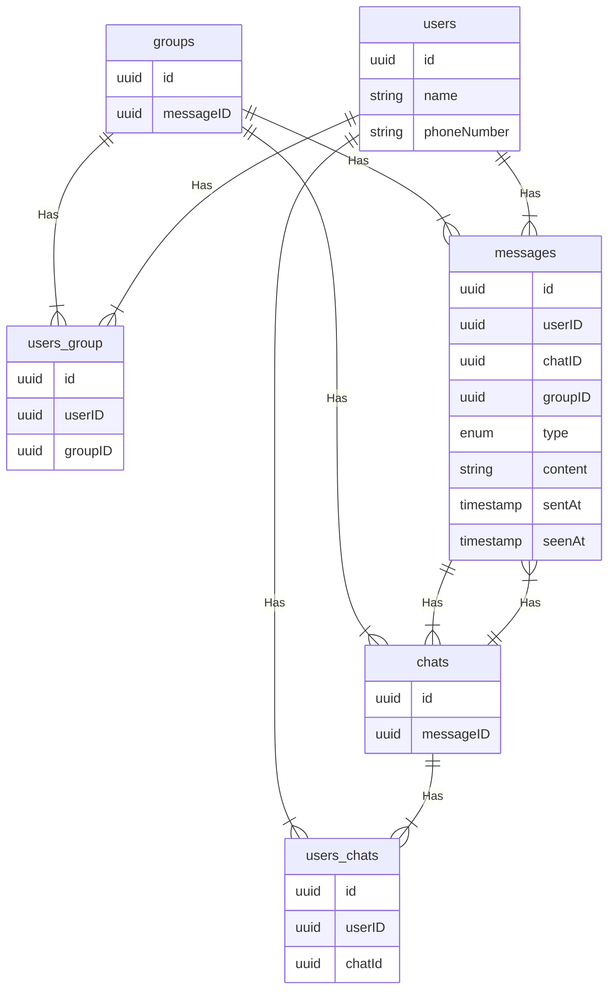

# Whatsapp
Let us design whatsapp like instant messaging service, similar to services like Whatsapp, Facebook Messenger, and wechat
## What is Whatsapp
Whatsapp is a chat application that provides instant messaging services to its users. it is one of the most used mobile applications on the planet connecting over 2 billion users in 180+ countries, whatsapp is also available on the web

## Requirements
our system should meet the following requirements

### Functional Requirements
* should support one-to-one chat - as a user I should be able to send a message to another user
* group chats(max 100 people) - I should be able to join/leave and to send and receive messages from groups
* should support file sharing(image, video, etc.) - should be able to send and receive a file to/from a channel
### Non-Functional Requirements
* high availability with minimal latency
* the system should be scalable and efficient
### Extended Requirements
* sent,delivered, and read receipts of the message
* show the last seen time of users
* push notifications
## Estimation and Constraints
let's start with the estimations and constraints
PRO-TIP: make sure to check any scale or traffic related assumptions with your interviewer

### Traffic
Let us assume we have 50 million daily active users(DAU) and on average each user sends at least 20 messages to 4 different people every day. This gives us 2 billion messages every day
        
            50 million * 10 messages * 4 people = 2 billion / day
messages can also contain media such as images, videos, or other files. we can assume that 5 percent of messages are media files shared by the users, which gives us additional 200 million files we would need to store.

            5 percent * 2 billion = 200 million / day

### what would be requests per second for our system
2 billion requests per day translate into 24K requests per second
        
            2 billion / (24 hrs * 3600 seconds) =~ 24K requests per second

### Storage
if we assume each message on average is 100 bytes, we will require about 200 GB of database storage every day
    
            2 billion * 100 bytes =~ 200GB / day
as per our requirements, we also know that around 5 percent of our daily message(100 million ) are media files. if we assume each file is 50 KB on average, we will require 10 TB of storage every day

            100 million * 20 KB = 10 TB / day
and for 10 years, we will require about 38 PB of storage

            (10 TB + 0.2 TB) * 10 years * 365 days =~ 38 PB
### Bandwidth
as our system is handling 10.2 TB of ingress every day, we will require a minimum bandwidth of around 120 MB per second

            10.2 TB /(24 hrs * 3600 seconds) =~ 120 MB / second
### High Level Estimates
here is a table of our high leve estimates

| Type                    | Estimate   |
|-------------------------|------------|
| Daily Active Users(DAU) | 50 million |
| Requests per second     | 24K        |
| storage / day           | ~10.2 TB   |
| storage(10 years)       | ~38 PB     |
| Bandwidth               | ~120MB/s   |

## Data Model Design
this is the general data model which reflects our requirements




let's go through the tables

### users
this table will contain a user's information such as ```name```, ```phoneNumber```, and other details

### messages
as the name suggests, this table will store messages with properties such as ```type```(text, image, video, etc.), ```content```, and timestamps for message delivery. the message will also have a corresponding ```chatID```, or ```groupID```
### chats
this table typically represents a private chat between two users and can contain multiple messages
### users_chats
this table maps users and chats as multiple users can have multiple chats
(N:M relationship) and vice versa
### groups
this table represents a group between multiple users
### users_groups
this table maps users and groups as multiple users can be a part of multiple groups. (N:M relationship) and vice versa.
## What kind of database should we use
while our data model seems quite relational, we don't necessarily need to store everything in a single database, as this can limit our scalability and quickly become a bottleneck
we will split data between different services each having ownership over a particulaer table. then we can use a relational database such as PostgresQL or a distributed NoSQL database such as Apache Cassandra for our use case

## API Design
let us do basic API design for our services
### Get all chats or groups
this API will get all chats or groups for a given ```userID```
```java
getAll(userID: UUID): Chat[] | Group[]
```
#### Parameters
User Id(```UUID``): ID of the current user
#### Returns
Result(```Chat[] | Group[]``): All the charts and the groups the user is part of.


### Get messages
Get all messages for a user given the```channelID```(chat or group id)
```java
getAllMessages(userID: UUID, chanellID: UUID): Message[]
```
#### Parameters
User Id(```UUID```): ID of the current user
Channel Id(```UUID```): Id of the channel(chat or group) from which messages need to be retrieved
#### Returns
Messages(```Message[]```): All the messages in a given chat or group


### Send messages
send a message from a user to a channel(chat or group)
```java
sendMessage(userID: UUID, chanellID: UUID, message: Message): boolean
```
#### Parameters
User Id(```UUID```): ID of the current user
Channel Id(```UUID```): Id of the channel(chat or group)user wants to send a message
Message(```Message```): the message (text, image, video, etc..) that the user wants to send
#### Returns
Result(```boolean```): Represents whether the operation was a success or not

### Join or Leave a group
a user leaves or joins a group
```java
joinGroup(userID: UUID, chanellID: UUID): boolean
leaveGroup(userID: UUID, chanellID: UUID): boolean
```
#### Parameters
User Id(```UUID```): ID of the current user
Channel Id(```UUID```): Id of the channel(group )user wants to join or leave
#### Returns
Result(```boolean```): Represents whether the operation was a success or not

## High-Level Design
now let us do a high level design of our system

### Architecture
We will be using microservices architecture since it will make it easier  to horizontally scale and decouple our services.Each service will have ownership of its own data model. let us divide our system into some core services

### User Service
this is an HTTP-based service that handles User-related concerns such as authentication and user information
### Chat Service
the chat service will use web sockets and establish connections with the client to handle chat and group message-related functionality. we can also use cache to keep track of all the active connections sort of like sessions which help us determine if the user is online or not. 
### Notification Service
the service will simply send push notifications to the users. we will discuss in detail separately
### Presence Service
the presence service will keep track of the last seen status of all users. it will be discussed in detail separately
### Media Service
this service will handle the media(images, videos, files, etc.) uploads. it will be discussed in detail separately

### What about inter-service communication and service discovery
since our architecture is microservices-based, services will be communicating with each other as well. Generally REST or HTTP performs well but we can further improve the performance using gRPC which is more lightweight and efficient.
service discovery is another thing that we have to take into account. we can also use a service mesh that enables managed, observable, and secure communication between individual services.

## Real time messaging
how do we efficiently send and receive messages? we have two options

### Pull model
the client can periodically send an HTTP request to servers to check if there are any new messages. this can be achieved via something like Long Polling.

### Push Model
the client opens a long-lived connection with the server and once new data is available it will be pushed to the client. we can use websockets or serversentevents for this.

the pull model approach is not scalable as it will create unnecessary request overhead on our servers and most ot the time the response will be empty, thus wasting our resources. to minimize latency, using the push model with websockests is a better choice because we can push data to the client once it is available without any delay given the connection is open with the client also. also, web sockets provide full-duplex communication, unlike server-sent events which are only unidirectional. 

## Last Seen
to implement the last seen functionality, we can use a heartbeat mechanism, where the client can periodically ping the servers indicating its liveness. since this needs to be as low overhead as possible, we can store the last active timestamp in the cache as follows

| Key    | Value               |
|--------|---------------------|
| User A | 2022-07-01T14:32:50 |
|User B  | 2022-07-01T14:10:35 |
|User C  | 2022-07-01T14:33:25 |

this will give us the last time the user was active. this functionality will be handled by the presence service combined with Redis or memcached as our cache
another way to implement this is to track the latest action of the user, once the last activity crosses a certain threshold, such as user has not performed any action in the last 30 seconds we can show the usr as offline and last seen with the last recorded timestamp. this will be a more of a lazy update approach and might benefit us over heartbeat in certain cases
## Notifications
once a message is sent in a chat or a group, we will first check if the recipient is active or not, we can get this information by taking the user's active connection and last seen into consideration
if the recipient is not active, the chat service will add an event to a message queue with additional metadata such as the clients's device platform which will be used to route the notification to the correct platform later on.
the notification service will then consume the event from the message queue and forward the request to Firebase cloud messaging or apple push notification service. based on the client's device platform. we can also add support for email and sms.

### why are we using a message queue
since most message queues provide best-effort ordering which ensures  that messages are generally delivered in the same order as they are sent and that a message id=s delivered at least once which is an important part of our service functionality.

while this seems like a classic publish-subscribe use case, it is actually not. as mobile devices and browsers have their own way of handling push notifications. usually, notifications are handled externally via firebase cloud or messaging or apple push notification service unlike message fan-out which we commonly see in backend services. we can use something like Amazon SQS or rabbitMQ to support this functionality.

### Read Receipts
handling read receipts can be tricky, for this use case we can wait for some sort of acknowledgement from the client to determine if the message was delivered and update the corresponding ```deliveredAT``` field. similarly, we will mark message as seen once the user opens the caht and update the corresponding ```seenAt``` timestamp field.

## Design
Now that we have identified some core components, let us do the first draft of our system design. 


## Detailed Design
it is time to discuss our design decisions in detail

### Data partitioning
to scale our database we will need to partition our data. horizontal partitioning(sharding) can be a good first step. we can use partitions schemes such as
* Hash-based partitioning
* list-based partitioning
* Range-based partitioning
* Composite partitioning

the above approaches can still cause uneven data and load distribution, we can solve this using consistent hashing. 

## Caching
in a messaging application, we have to be careful about using cache as our users expect the latest data, nut many users will be requesting the same messages especially in a group caht. so, to prevent usage spikes from our resourrces we can cache older messages.
some group chats can have thousands of messages and sending that over the network will be really inefficient, to improve efficiency we can add pagination to our system APIs.this decision will be helpful for users with limited netwrok bandwidth as they wont have to retrieve old essages unless requested

### which cache eviction policy to use
we can use solutions like redis or memcached and cache 20% of the daily traffic but what kind of cache eviction policy would best fit our needs?
least recently used can be a good policy for our system. in this policy, we discard the least recently used key first.

### How to handle cache miss
whenever there is a cache miss, our servers can hit the database directly and update the cache with the new entries.

## Media access and storage
as we know, most of our storage space will be used for storing media files such as images, videos, or other files. our media service will be handling both access and storage of the user media files. 
but where can we store files at scale? well, object storage is what we are looking for. object stores those objects in a single repository, which can be spread out across multiple networked systems. we can also use distributed file storage such as HDFS or GlusterFS

Fun-Fact: whatsapp deletes media on its servers once it has been downloaded by the user.
we can use object stores like Amazon S4, Azure blob storage or google cloud storage for this use case.

## Content Delivery Netwotk
CDN increases content availability and redundancy while reducing bandwidth costs. generally, static files such as images, and videos are served from CDN. we can use services like Amazon CloudFront or cloudflare CDN for this use case. 

## API Gateway
since we will be using multiple protocols like HTTP, websocket,TCIP/IP, deploying multiple L4(transport layer) or L7(application layer) type load balancers separately for each protocol will be expensive. instead, we can use an API gateway that supports multiple protocols without any issues.
API Gateway can also offer other features such as authentication, authorization, rate limiting, throttling, and API versioning which will improve the quality of our services
we can use services like Amazon API Gateway or azure API Gateway for this use case.

## Identify and resolve bottlenecks

let us identify and resolve bottlenecks such as single point of failure in our design
* what if one of our services crash?
* how will we distribute our traffic between our components?
* how can we reduce the load on our databases?
* how to improve the availability of our cache?
* wouldn't API Gateway be a single point of failure?
* how can we make our notification system more robust?
* how can we reduce media storage cost?
* does chat service has too much responsibility?

To make our system more resilient we can do the following
* running multiple instances of each of our services.
* introducing load balancers between our clients, services, databases and cache servers
* using multiple read replicas for our databases
* multiple instances and replicas for our distributed cache
* we can have a standby replica of our API Gateway
* exactly once delivery and message ordering is challenging in a distributed system, we can use a dedicated message broker such as apache kafka or NATS to make our notification system more robust
* we can add media processing and compression capabilities to the media service to compress large files similar to whatsapp which will save a lot of storage space and reduce cost.
* we can create a group chat service separate from the chat service to further decouple our services.


